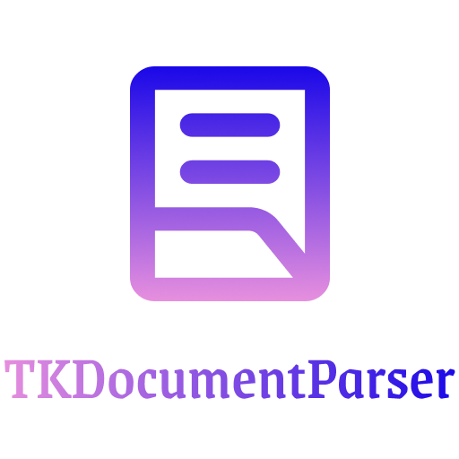

# TKDocumentParser


`TKDocumentParser` is a Swift package for parsing documents. It provides a simple API to process and handle document content.

## Table of Contents

- [Swift Package Index](https://swiftpackageindex.com/toseefkhilji/TKDocumentParser)
- [Demo](#demo)
- [Installation](#installation)
- [Usage](#usage)
  - [Usage Examples](#usage-examples)
- [Documentation](#documentation)
- [Contribution](#contribution)
- [License](#license)

## Demo
To see `TKDocumentParser` in action, check out the example project included in the `TKDocumentParserDemo` repo. Open `TKDocumentParserDemo.xcodeproj` in Xcode to run the demo app and see how the package works.

- [https://github.com/toseefkhilji/TKDocumentParserDemo](https://github.com/toseefkhilji/TKDocumentParserDemo)

## Installation

### Swift Package Manager

To add WingedSwift to your project, add the following line to your `Package.swift` file:

```swift
dependencies: [
    .package(url: "https://github.com/toseefkhilji/TKDocumentParser.git", from: "1.0.0")
]
```


And include `TKDocumentParser` as a dependency in your target:

```swift
targets: [
    .target(
        name: "YourTarget",
        dependencies: ["TKDocumentParser"]),
]
```

To include in Vapor project use this line code in `executableTarget`.

```swift
.product(name: "TKDocumentParser", package: "TKDocumentParser")
```

## Usage

TKDocumentParser allows you to get plain text from documents.

### Basic Example

```swift
import TKDocumentParser

do {
        let url = // your local file path
        let text = try TKDocumentParser.parseText(from: url)
        print("extractedText: \(text)")
} catch {
        print(error.localizedDescription)    
}
```

## Documentation

The complete documentation is available [here soon]().

### Generating the Documentation

To generate the DocC documentation, use the following command in the terminal:

```bash
swift package generate-documentation --target WingedSwift --output-path ./docs
```

```bash
open ./docs/index.html
```

### Preview Documentation

```
swift package --disable-sandbox preview-documentation --target WingedSwift
```

- [http://localhost:8080/documentation/wingedswift](http://localhost:8080/documentation/wingedswift)


## Contribution

Contributions are welcome! Please follow the steps below to contribute:

1. Fork the repository
2. Create a new branch (`git checkout -b feature/new-feature`)
3. Commit your changes (`git commit -am 'Add new feature'`)
4. Push to the branch (`git push origin feature/new-feature`)
5. Open a Pull Request

## License

This project is licensed under the MIT License. See the [LICENSE](LICENSE) file for more details.